### Hello there, I'm Garcia Milord 👋

#### Full-Stack Software Engineer

I'm a **Full-Stack Software Engineer** with experience building scalable applications, APIs, and business integrations.
I currently work with **TypeScript, Next.js, React, Node.js, and Express**, supported by a strong back-end background in **Java and Python**.

Previously at Oracle, I helped develop and maintain financial and ERP integrations, automated workflows, and reliable back-end services.
I enjoy simplifying complex business requirements through clean, maintainable engineering.

---

### 💡 What Drives Me

I'm curious about how systems work and enjoy building practical solutions that solve real business problems. My primary interests include:

* **Full-Stack Development:** Building responsive user experiences and reliable back-end services.
* **API and Integration Development:** Connecting applications, platforms, and business systems.
* **Cloud and DevOps:** Improving deployments, automation, scalability, and system reliability.
* **AI-Assisted Engineering:** Using modern AI tools to improve development workflows and productivity.

I believe in **lifelong learning** and am always exploring new frameworks and technologies to build better, more meaningful solutions.

---

### 🛠️ My Toolbox

| Category | Skills & Tools |
| :--- | :--- |
| **Languages** | TypeScript, Java, Python, JavaScript, SQL, Go |
| **Frontend** | Next.js, React, Angular, HTML, CSS |
| **Backend** | Node.js, Express, Spring Boot, Flask, FastAPI |
| **Databases** | PostgreSQL, Oracle Database, MySQL, MongoDB, Microsoft SQL Server |
| **Cloud & DevOps**| AWS, Oracle Cloud Infrastructure, Docker, Kubernetes, GitHub Actions, Jenkins |
| **Tools** | Git, GitHub, Postman, Linux, VS Code, Codex |

---

### My GitHub Stats

<table>
  <tr>
    <td>
      
    </td>
    <td>
      
    </td>
    <td>
      
    </td>
  </tr>
</table>

### 🤝 Connect With Me
You can find me on [LinkedIn](https://www.linkedin.com/in/garcia-milord/).

